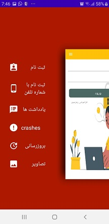
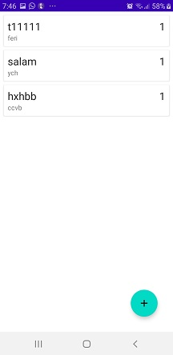
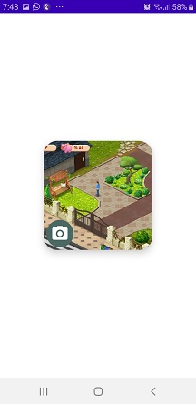

# Firbased
In short, this application includes all the features of communication with Firebase, which includes user authentication with email and phone number and data storage, as well as uploading images to the Firebase server and viewing those images inside the application itself. In addition, it is possible to check the version of the application and download the latest version through the Firebase server inside the app

            
            
